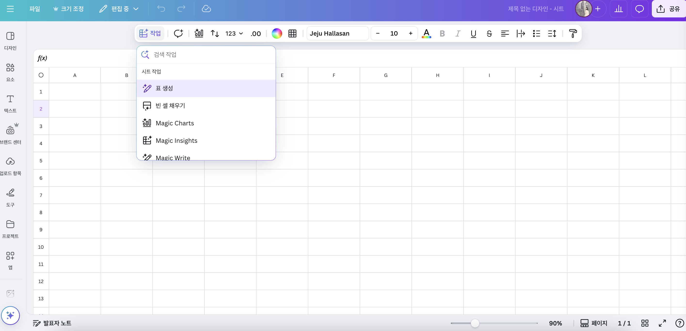

# Canva의 혁신적인 변화: Visual Suite 2.0 출시와 미래 디자인의 새 시대

*Canva Create 2025 이벤트에서 발표된 Visual Suite 2.0은 디자인과 생산성의 경계를 허무는 혁신적인 업데이트입니다.*

디자인 플랫폼의 대명사로 자리 잡은 Canva가 역대 최대 규모의 업데이트인 'Visual Suite 2.0'을 공개했습니다. A지난 4월 10일 로스앤젤레스에서 열린 'Canva Create 2025' 행사에서 발표된 이 업데이트는 디자인과 생산성 도구의 경계를 허물며 작업 방식의 패러다임 전환을 예고합니다.

## Visual Suite 2.0: 디자인과 생산성의 융합

Canva의 새로운 Visual Suite 2.0은 단순한 디자인 툴의 업데이트를 넘어, 일상 업무와 창의적 작업 과정을 통합하는 완전히 새로운 접근 방식을 제시합니다. 이제 사용자는 프레젠테이션, 비디오, 화이트보드, 웹사이트 등 모든 디자인 유형을 하나의 새로운 형식으로 원활하게 작업할 수 있게 되었습니다.

이 통합 환경은 팀 협업을 위한 게임체인저로, 다양한 형식의 콘텐츠를 단일 디자인 내에서 작업할 수 있게 해줍니다. 이는 복잡한 워크플로우를 단순화하고, 여러 애플리케이션 간 전환의 필요성을 제거함으로써 작업 효율성을 크게 향상시킵니다.

## Canva Sheets: AI 시대를 위해 재설계된 스프레드시트

*Canva Sheets는 데이터와 디자인을 하나로 통합하여 시각적인 스프레드시트 경험을 제공합니다.*

Visual Suite 2.0의 가장 주목할 만한 추가 기능 중 하나는 'Canva Sheets'입니다. 기존 스프레드시트의 개념을 완전히 새롭게 재해석한 이 도구는 데이터 분석과 시각화를 위한 강력한 솔루션을 제공합니다.

Canva Sheets는 AI 시대를 위해 설계되었으며, 'Magic Insights'와 'Magic Formulas'와 같은 AI 기반 기능을 통해 복잡하고 시간이 많이 소요되던 작업을 직관적이고 즐거운 경험으로 변화시킵니다. 사용자는 간단한 텍스트를 입력하기만 하면, AI가 복잡한 계산과 패턴 분석을 자동으로 수행합니다.

또한 'Magic Charts' 기능을 통해 복잡한 데이터를 몇 번의 클릭만으로 아름답고 브랜드에 맞는 시각 자료로 변환할 수 있습니다. 이는 프레젠테이션, 전략 문서 작성, 또는 데이터 분석 과정에서 인사이트를 명확하고 역동적인 방식으로 공유할 수 있게 해줍니다.

## Canva AI: 대화형 디자인 어시스턴트

Visual Suite 2.0의 핵심에는 'Canva AI'라는 대화형 AI 어시스턴트가 있습니다. 이 통합 어시스턴트는 아이디어 구상부터 실행까지 전체 과정을 지원합니다. 편집 가능한 디자인과 시각 자료 생성, 콘텐츠 작성까지, Canva의 생성형 도구를 하나의 직관적인 인터페이스로 통합하여 디자인 전문 지식 없이도 누구나 즉시 창작할 수 있도록 돕습니다.

사용자는 간단한 프롬프트를 통해 텍스트와 슬라이드를 몇 초 만에 생성하고, 아이디어를 쉽게 정리하며, 실행 가능한 요약을 만들 수 있습니다. 화이트보드에서 문서로의 변환도 클릭 한 번으로 가능합니다. AI가 작업 중인 바로 그 곳에 내장되어 있어, 앱 전환 없이 작업에 집중할 수 있습니다.

## Magic Studio의 확장: 창의성의 새로운 차원

*새로운 Magic Insights 기능은 데이터를 직관적이고 매력적인 시각적 정보로 변환합니다.*

기존의 Magic Studio 역시 Visual Suite 2.0과 함께 더욱 강력해졌습니다. Magic Design, Magic Write, Magic Media 등의 기능을 통해 사용자는 초안을 빠르게 작성하고, 텍스트를 이미지로 변환하며, 디자인 제안을 즉시 받아볼 수 있습니다.

특히 주목할 만한 기능은 다양한 미디어 형식 간의 자동 변환과 생성형 AI를 통한 이미지 즉시 편집 기능입니다. 이러한 도구들은 지루하고 노동 집약적인 창의적 작업을 자동화함으로써, 디자이너와 비디자이너 모두가 핵심 아이디어와 메시지 전달에 더 집중할 수 있게 해줍니다.

## 디자인 트렌드의 미래: 아날로그와 인간적 감성의 회귀

흥미롭게도, Canva는 또한 '2025 디자인 트렌드 리포트'를 통해 향후 디자인 트렌드에 대한 통찰을 공유했습니다. 1억 7천만 명이 사용하는 서비스의 검색 데이터를 바탕으로 분석한 결과, AI로 효율성과 정밀성이 높아지면서 역설적으로 인간만의 창의적인 독특함과 불완전함에 대한 가치가 상승하는 추세를 보이고 있습니다.

이는 Visual Suite 2.0이 AI의 효율성과 인간의 창의성 사이의 완벽한 균형을 추구하는 Canva의 철학을 반영한다고 볼 수 있습니다.

## 결론: 작업 방식의 패러다임 전환

Canva의 Visual Suite 2.0 출시는 단순한 제품 업데이트를 넘어, 우리가 디자인하고, 협업하고, 아이디어를 전달하는 방식의 근본적인 변화를 의미합니다. 디자인과 생산성 도구의 경계를 허물고, AI의 힘을 활용하여 누구나 쉽게 전문적인 결과물을 만들 수 있게 함으로써, Canva는 시각적 커뮤니케이션의 미래를 새롭게 정의하고 있습니다.

230만 명 이상의 월간 활성 사용자를 보유한 Canva는 이번 업데이트를 통해 Adobe와 같은 전통적인 디자인 소프트웨어 기업과의 경쟁에서 한 발 더 앞서나가며, 디자인 도구의 민주화라는 자사의 미션을 더욱 강화하고 있습니다.

Visual Suite 2.0은 이미 전 세계 사용자들에게 제공되고 있으며, Canva.com에서 직접 경험해 볼 수 있습니다.

---

이 블로그 포스트가 유용했다면 아래 소셜 미디어 버튼을 통해 공유해 주세요. Canva의 새로운 기능에 대한 여러분의 경험이나 의견이 있으시다면 댓글로 남겨주세요!